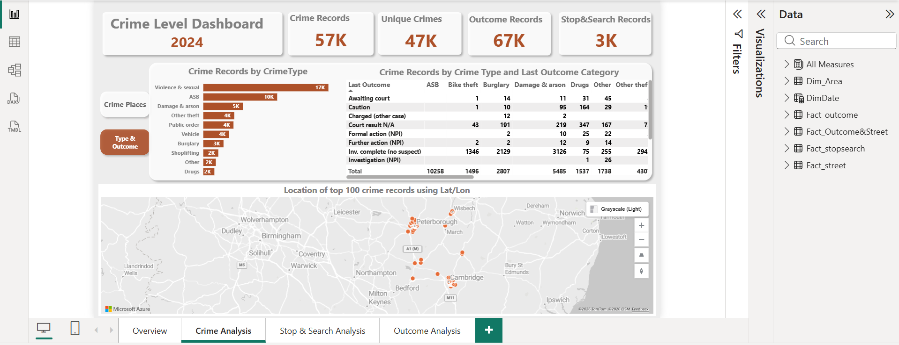
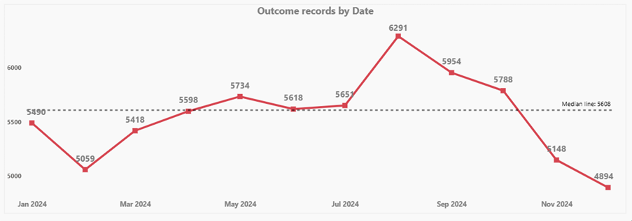
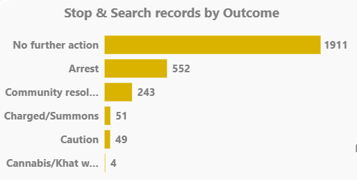

# Cambridgeshire Crime Trends 2024: Interactive PowerBI Dashboard Project

## Introduction

This project analyses UK open policing data to understand patterns in recorded street-level crime, stop-and-search activity, and case outcomes over time and across locations. The dataset is sourced from the UK Police open data platform and covers monthly extracts over the period Jan 2023 to Nov 2025 (focusing our dashboard on 2024).

The report was built end-to-end in Power BI, including data preparation (append + cleaning), modelling (fact/dimension structure), and visual analytics. The report combines three core datasets:

- **Street-level crime** (crime records with location, LSOA, crime type, and last outcome category),
- **Outcomes** (outcome records with outcome type and month), and
- **Stop & Search** (search events with outcome, object of search, and demographic fields such as age range and gender).

The dashboard is structured to answer practical questions such as:

- How do crime, stop & search, and outcomes vary over time?
- Which crime types and areas (LSOAs) account for the highest volumes?
- What is the most common stop & search outcomes and objects of search?
- Which outcome types are most frequently recorded, and how do they change month-to-month?

---

## Monthly Crime Records (2024)

Crime volume increases from early 2024 and peaks mid-year (highest around July, which is 5333), then declines toward year end. The median monthly level provides a baseline to spot above-normal months.

---

## Monthly Outcome Records (2024)

Outcome recording peaks later than crime volume (highest around Aug 6291), suggesting a lag between incident recording and outcome updates. A sharp decline appears in Nov–Dec.

---

## Top 100 Crime Locations (Lat/Lon)
.png)

The top 100 crime points cluster around major urban areas, indicating location concentration rather than evenly distributed incidents. Use LSOA rankings to quantify hotspots.

---

## Self-Defined vs Officer-Defined Ethnicity (Stop & Search)
.png)

Most records show agreement between self-defined and officer-defined ethnicity (strong diagonal). Differences exist in mixed/other categories and “unknown” values, which should be retained for transparency.

---

## Stop & Search Outcomes Distribution (2024)

Most stop & search records end with **No further action**, with **Arrest** the next most frequent. Other outcomes (community resolution, summons/charged, caution) occur at much lower volumes.

---

## Key Insights (Dashboard Findings)

- Overall volume (2024 view) is ~57K crime records, ~47K unique crimes (distinct Crime_ID), ~67K outcome records, and ~3K stop & search records.
- Outcome records exceed unique crimes, which is expected because outcomes are logged as records/events and a single crime may generate more than one outcome record.
- Crime records vary month-to-month, peaking mid-year and declining toward the end of the year in the 2024 view.
- A small number of LSOAs account for a disproportionately high share of crime records (hotspot pattern visible in “Top LSOA” chart).
- The largest category in 2024 is **Violence and sexual offences**, followed by **Anti-social behaviour**, then categories such as criminal damage/arson, other theft, public order, vehicle crime, burglary, and shoplifting.
- The most frequent result is **A no further action** outcome, with **Arrest** as the next most common outcome and smaller counts for community resolution and summons/charged.
- **Controlled drugs** is the most common object of search, followed by items like offensive weapons and articles related to theft/criminal damage.
- In the 2024 view, stop & search records are mostly associated with **Male** entries (~84%), with **Female** (~11%) present (reported as record distributions, not offender characteristics).
- The highest stop & search volume appears in **18–24**, followed by **Over 34** and **25–34**, with an **“Unknown age”** group retained for transparency.
- The leading outcome types include **Unable to prosecute suspect** and **Investigation complete; no suspect identified**, followed by smaller categories such as suspect charged and local resolution.
- **Outcome type by month** enables tracking how specific outcome categories change over time.

## Author:
Linkedin: [Nasrine Gouader](https://www.linkedin.com/in/nasrine-gouader)

## References:
Street level crime: [police.uk data](https://www.data.gov.uk/dataset/bb2c3b16-6719-4e00-ae75-48dd462cb915/england-national-crime-mapping)

## Thanks:
* [Bashar Mohammad](https://www.linkedin.com/in/bashar-mohammad-phd-14a64288)
